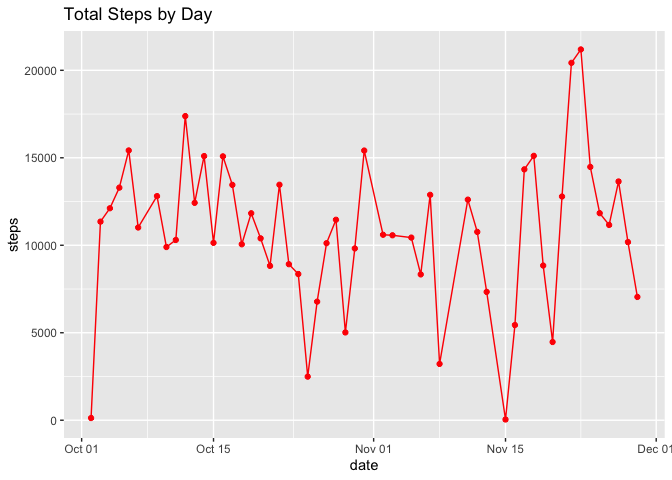
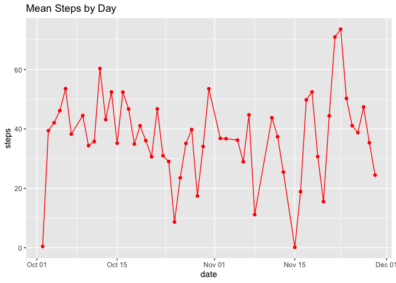
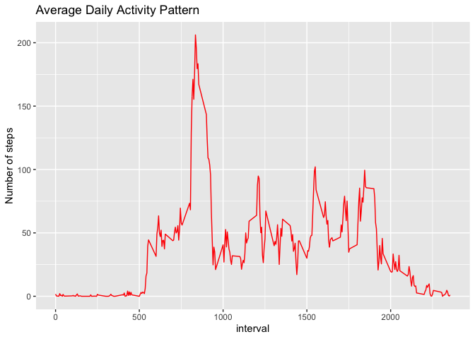
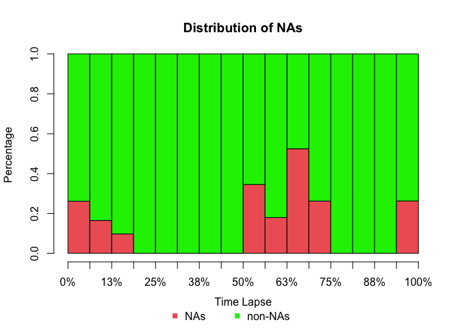
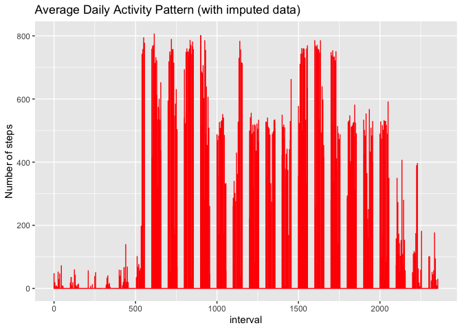
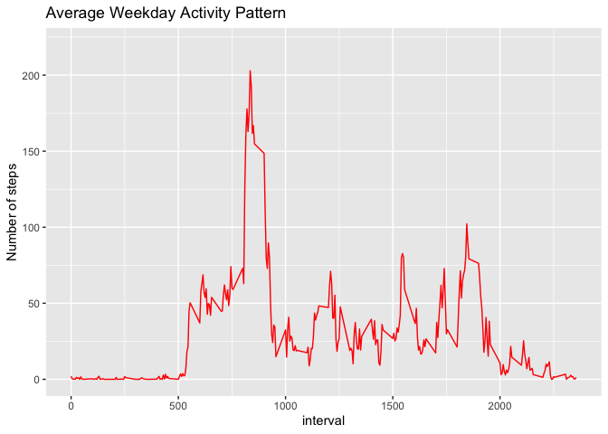
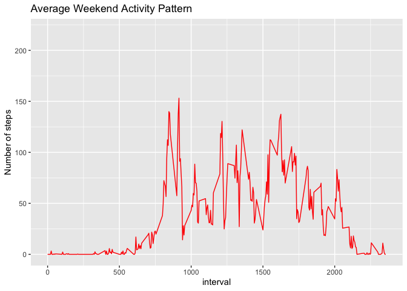

## Loading and preprocessing the data

```r
# load libraries
library(readr)
library(ggplot2)
library(imputeTS)
library(dplyr)
# unzip and load
unzip("activity.zip")
activity_data <- read_csv("activity.csv", col_types = cols(date = col_date(format = "%Y-%m-%d")))
```

## What is mean total number of steps taken per day?

```r
total_steps_by_date <- aggregate(steps ~ date,activity_data, sum, na.rm = TRUE)
mean_steps_by_date <- aggregate(steps ~ date,activity_data, mean, na.rm = TRUE)
```

<!-- --><!-- -->


## What is the average daily activity pattern?

```r
# Calculate mean steps per interval and omit NAs
average_daily_activity_pattern <- aggregate(steps ~ interval,activity_data, mean, na.rm = TRUE)
```

<!-- -->


## Imputing missing values

```r
# I use the imputeTS library to analyze and impute values based on moving avergae values
# display missing value stats
statsNA(activity_data$steps)
```

```
## [1] "Length of time series:"
## [1] 17568
## [1] "-------------------------"
## [1] "Number of Missing Values:"
## [1] 2304
## [1] "-------------------------"
## [1] "Percentage of Missing Values:"
## [1] "13.1%"
## [1] "-------------------------"
## [1] "Stats for Bins"
## [1] "  Bin 1 (4392 values from 1 to 4392) :      576 NAs (13.1%)"
## [1] "  Bin 2 (4392 values from 4393 to 8784) :      0 NAs (0%)"
## [1] "  Bin 3 (4392 values from 8785 to 13176) :      1440 NAs (32.8%)"
## [1] "  Bin 4 (4392 values from 13177 to 17568) :      288 NAs (6.56%)"
## [1] "-------------------------"
## [1] "Longest NA gap (series of consecutive NAs)"
## [1] "576 in a row"
## [1] "-------------------------"
## [1] "Most frequent gap size (series of consecutive NA series)"
## [1] "288 NA in a row (occuring 6 times)"
## [1] "-------------------------"
## [1] "Gap size accounting for most NAs"
## [1] "288 NA in a row (occuring 6 times, making up for overall 1728 NAs)"
## [1] "-------------------------"
## [1] "Overview NA series"
## [1] "  288 NA in a row: 6 times"
## [1] "  576 NA in a row: 1 times"
```

```r
# use moving average to impute
imputed_steps <- na_ma(activity_data$steps, k = 4, weighting = "exponential", maxgap = Inf)
# replace missing values
activity_data_imputed <- activity_data %>% mutate(steps  = ifelse(is.na(steps), imputed_steps[1], steps))
```

<!-- --><!-- -->


## Are there differences in activity patterns between weekdays and weekends?


```r
# use daily activity with imputed data, create indicator for weekend days and subset data 
activity_data_imputed <- mutate(activity_data_imputed, day = weekdays(activity_data_imputed$date))
weekend_days <- c('Saturday', 'Sunday')
activity_data_imputed$weekend <- factor((weekdays(activity_data_imputed$date) %in% weekend_days), levels=c(TRUE, FALSE))

weekdays <- subset(activity_data_imputed, weekend == FALSE)
weekends <- subset(activity_data_imputed, weekend == TRUE)
```

<!-- --><!-- -->
